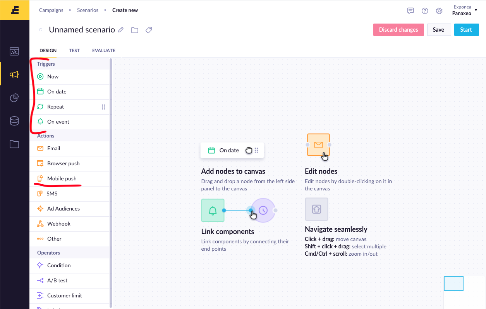

# Sending Push notifications

## Payload constructing
Exponea web app provides great notifications builder, where you can customize all the interaction and how it will be presented to users

1. First open Exponea Web App and choose **Campaigns->Scenarios** from the left menu

  

2. To create new Campaign, prees **Create new** button

  

3. This will open a **Campaign Builder** where you can specify when/how your push notification is triggered. You can drag and drop components from the menu and connect triggers to actions. You can find more information on Campaign Builder in [Exponea documentation](https://docs.exponea.com/docs/scenarios-1).

  

  


4. Double-clicking the push notification node will open notification builder. There you can specify **Title (1)** and **Message (2)** for your notification. There is a **Preview (4)** on the right side that will show what the notification is going to look like. Use **platform settings (5)** to preview/set platform for test push notification to either Android or iOS. There is also an option to specify an **Image (6)** you want to display and **Sound (9)** that will be played when notification is received.

> When specifying the sound, provide sound name without extension.


5. You can also select **Interaction (3)** performed when user opens the notification. There are 3 options available:
  * Open Application
  * Open Browser
  * Open Deeplink

  

6. Additionally you can specify more **Interactions** by Pressing **Add Action button (8)**


8. Lastly, you can specify additional **Data** you want to send using key-value pairs


## Sending a test push notification
First you'll need to identify your test user with email address. Run the following code in your app:
```dart
import 'package:exponea/exponea.dart';

final _plugin = ExponeaPlugin();
_plugin.identifyCustomer(Customer(ids: {'registered': 'test@test.com'}));
```

for iOS devices and Android 13 and newer devices, you also need to request permission for receiving push notifications. Run the following code in your app, when you want to prompt user to grant the permissions:
```
_plugin.requestPushAuthorization();
```

Then select the user by email in the notification builder preview, select platform and click **Test push notification** button. The push notification should arrive to your device shortly. Receiving push notifications also works on iOS Simulators and Android emulators. For more info about working with iOS simulaors, please visit [Work with iOS simulator](https://github.com/panaxeo/exponea_ios-sdk/blob/develop/Documentation/PUSH.md#work-with-ios-simulator)